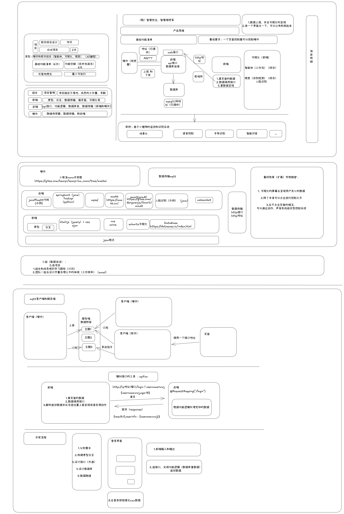

# 智慧宠物烟感安全系统

> 基于 MQTT 物联网关 + Spring Boot + Vue 3 的实时烟雾浓度监测、阈值告警与设备联动平台。



---

## 目录 / Table of Contents

- [功能特性 / Features](#功能特性--features)
- [技术栈 / Tech Stack](#技术栈--tech-stack)
- [系统架构 / Architecture](#系统架构--architecture)
- [仓库结构 / Repository Structure](#仓库结构--repository-structure)
- [快速开始 / Quick Start](#快速开始--quick-start)
- [开发指南 / Development Guide](#开发指南--development-guide)
- [外部服务与凭据 / External Services](#外部服务与凭据--external-services)
- [数据库设计 / Database Design](#数据库设计--database-design)
- [API 接口 / API Reference](#api-接口--api-reference)
- [部署说明 / Deployment](#部署说明--deployment)
- [开发进度 / Project Status](#开发进度--project-status)
- [协作规范 / Collaboration](#协作规范--collaboration)
- [相关文档 / Related Docs](#相关文档--related-docs)

---

## 功能特性 / Features

系统围绕「采集 → 入库 → 判断 → 告警 → 联动 → 展示」闭环设计，核心能力包括：

- **实时烟雾浓度监测**：硬件传感器采集 → MQTT 上报 → 后端入库 → 前端每 3 秒轮询呈现。
- **鹦鹉环境监测**：实时监控页展示温度与湿度；数据库已提供独立历史表，MQTT 入库和后端查询待接入。
- **历史浓度趋势可视化**：ECharts 折线图，支持实时 / 6h / 12h / 24h / 7d 多时间范围切换，叠加中风险与高风险阈值线。
- **阈值告警与风险分级**：按 ppm 自动映射 `normal` / `low` / `medium` / `high` 四级，超阈值自动生成告警记录。
- **设备联动控制**：危险状态自动联动蜂鸣器 / 报警灯 / 排风扇，前端可手动控制开关。
- **可视化大屏与主题切换**：四套主题（安全 / 低风险 / 中风险 / 高风险），随风险等级动态切换背景。
- **MQTT 数据自动入库**：`device/getData` 服务当前订阅公网 MQTT `group23` 主题，解析 `ppm` 并写入 `smoke_data`；温湿度入库尚待扩展。
- **告警全生命周期管理**：告警触发 → 处理中 → 已处理，支持处理人备注与时间线追溯。
- **可扩展加分项**：预留 AI 视觉复核（SmartJavaAI）与警情智能问答（MaxKB / RAG）接口。

> 完整用户故事与业务流程见 [03_智慧烟感_基本功能清单.md](03_智慧烟感_基本功能清单.md)。

---

## 技术栈 / Tech Stack

| 模块 | 路径 | 技术栈 | 端口 | 作用 |
|---|---|---|---|---|
| 后端 Backend | [backend/](backend/) | Java 17 · Spring Boot 3.3.5 · Maven · MySQL 5.7 · Spring Data JPA · Lombok · Validation | `8080` | 业务 API、数据入库、风险判断、告警生成 |
| 前端 Frontend | [frontend/](frontend/) | Vue 3.5.17 · Vite 6.3.5 · ECharts 5.6.0 | `5173` (dev) | 可视化大屏、设备控制、主题切换 |
| 设备端·数据消费 | [device/getData/](device/getData/) | Java 8 · Spring Boot 2.3.5 · Paho MQTT · JDBC · Hutool | — | 订阅 MQTT `group23`，写入 `smoke_data` 表 |
| 设备端·MQTT 工具 | [device/MQTT/mqtt01-master/](device/MQTT/mqtt01-master/) | Java 8 · Spring Boot 2.3.5 · Paho MQTT · Web · Hutool | `9091` | MQTT 收发工具 + REST API 控制设备 |

---

## 系统架构 / Architecture

```
                          ┌──────────────────────┐
                          │   硬件传感器 / 小熊派  │
                          └──────────┬───────────┘
                                     │ MQTT 发布烟雾/温度/湿度数据
                                     ▼
                          ┌──────────────────────┐
                          │   MQTT Broker 公网    │
                          │ 47.108.58.107:1883    │
                          │ topic: group23        │
                          └──────┬───────────┬───┘
                                 │           │
                  订阅 group23   │           │  REST 控制下发
                                 ▼           ▼
              ┌──────────────────────┐   ┌──────────────────────┐
              │  device/getData      │   │  device/MQTT 工具     │
              │  (数据消费服务)       │   │  (收发工具 + REST API) │
              │  解析 ppm + 计算风险  │   │  /publishTopic /on /off│
              │  温湿度接入：待实现    │   │                       │
              └────────┬─────────────┘   └──────────────────────┘
                       │ INSERT smoke_data
                       │ temperature_data / humidity_data：待接入
                       ▼
              ┌──────────────────────┐
              │     MySQL 5.7        │   ← backend (Spring Data JPA)
              │  47.108.58.107:3306   │     查询/入库/告警判断
              │  database: dream28    │
              └──────────┬───────────┘
                         │ HTTP API (port 8080)
                         ▼
              ┌──────────────────────┐
              │   frontend Vue 3     │
              │   可视化大屏 (5173)   │
              └──────────────────────┘
```

**数据流说明**：
1. 硬件传感器采集烟雾浓度、温度和湿度，通过 MQTT 协议发布到公网 Broker 的 `group23` 主题。
2. `device/getData` 服务当前解析 `ppm`、计算风险等级并写入 `smoke_data`；后续将温度、湿度分别写入 `temperature_data`、`humidity_data`。
3. `backend` Spring Boot 服务通过 JPA 读写 MySQL，当前提供烟雾、告警和设备接口；温湿度查询接口待接入。
4. `frontend` Vue 页面已展示鹦鹉实时监控与温湿度环境指标，当前温湿度仍使用 mock 数据。
5. `device/MQTT` 工具模块提供 REST 接口，用于向设备下发控制指令（开关蜂鸣器/报警灯/排风扇）。

---

## 仓库结构 / Repository Structure

```
Chinasoft-Project-group23/
├── backend/                      # 后端 Spring Boot 服务 (Java 17)
│   ├── pom.xml
│   ├── README.md                 # 后端说明
│   └── src/main/java/com/chinasoft/smokesensor/
│       ├── SmokeSensorApplication.java
│       ├── common/               # ApiResult / BusinessException / GlobalExceptionHandler
│       ├── controller/           # 5 个：Smoke/Alarm/Device/System(已实现查询) + DeviceData(待补)
│       ├── dto/                  # 请求/响应 DTO
│       ├── entity/               # AlarmRecord / Device / SensorData
│       ├── repository/           # JPA Repository
│       ├── service/              # 业务接口
│       └── service/impl/         # 业务实现
├── frontend/                     # 前端 Vue 3 + Vite 大屏
│   ├── package.json
│   ├── vite.config.js
│   ├── index.html
│   └── src/
│       ├── App.vue               # 主组件（大屏单页）
│       ├── api/dashboard.js      # API 调用层（当前走 mock）
│       ├── mockData.js           # mock 数据与风险等级阈值
│       ├── style.css             # 四套主题样式
│       └── main.js
├── device/                       # 设备端
│   ├── MQTT/mqtt01-master/       # MQTT 收发工具 + REST API (端口 9091)
│   └── getData/                  # MQTT 数据订阅与入库服务
│       └── README.md
├── docs/                         # 项目需求文档
│   └── PROJECT_REQUIREMENTS.md
├── 文档/                          # 架构 / API / 数据库设计文档
│   ├── 智慧烟感系统架构设计.md
│   ├── 智慧烟感API接口文档.md
│   └── 智慧烟感数据库表结构设计.md
├── 原型设计/                      # 原型图资源
├── 03_智慧烟感_基本功能清单.md
├── 智慧烟感数据库表结构设计.md      # 根目录副本（详见 文档/ 目录）
├── 生成考勤与开发日志表.py
├── .gitignore
└── README.md                     # 本文件
```

> `device/MQTT/__MACOSX/` 为 macOS 压缩包产生的元数据垃圾文件，可忽略。

---

## 快速开始 / Quick Start

### 环境要求 / Prerequisites

| 工具 | 版本 | 用途 |
|---|---|---|
| JDK | 17+ | 后端运行（设备端模块需 JDK 8+） |
| Maven | 3.8+ | Java 依赖管理与构建 |
| Node.js | 18+ | 前端运行 |
| MySQL | 8.0+ | 数据存储 |
| Git | 任意 | 版本控制 |

### 各模块启动 / Start Each Module

> ⚠️ 启动前请先确认能访问下方 [外部服务](#外部服务与凭据--external-services) 中的公网 MQTT 与 MySQL，或在各 `application.yml` 中替换为你本地的地址。

**1. 后端 Backend**

```bash
cd backend
# 按需修改 src/main/resources/application.yml 中的数据库连接
mvn spring-boot:run
# 启动后监听 http://localhost:8080
```

**2. 前端 Frontend**

```bash
cd frontend
npm install
npm run dev
# 启动后监听 http://localhost:5173
```

**3. 设备端·数据消费 getData**

```bash
cd device/getData
mvn spring-boot:run
# 自动订阅 MQTT group23 主题，解析 ppm 写入 smoke_data 表
```

**4. 设备端·MQTT 工具**

```bash
cd device/MQTT/mqtt01-master
mvn spring-boot:run
# 启动后监听 http://localhost:1883
```

---

## 开发指南 / Development Guide

### 后端 Backend

- **包根**：`com.chinasoft.smokesensor`
- **分层规范**：`controller`（仅接收请求/返回结果）→ `service/impl`（业务逻辑）→ `repository`（数据库操作）→ `entity`（表映射）→ `dto`（请求/响应载体）。业务逻辑**不得**写在 Controller 中。
- **统一响应**：所有接口返回 [common/ApiResult.java](backend/src/main/java/com/chinasoft/smokesensor/common/ApiResult.java) 包装的 `{code, message, data}` 结构。
- **异常处理**：业务异常抛 `BusinessException`，由 `GlobalExceptionHandler` 统一捕获。
- **数据库**：`spring.jpa.hibernate.ddl-auto: none`，**不自动建表**，需手动执行 [文档/智慧烟感数据库表结构设计.md](文档/智慧烟感数据库表结构设计.md) 中的建表 SQL。
- **风险等级阈值**（与设备端一致）：

  | ppm 区间 | 风险等级 |
  |---|---|
  | 0–100 | `normal` |
  | 101–199 | `low` |
  | 200–400 | `medium` |
  | >400 | `high` |

- **构建**：`mvn clean package`
- 详细说明见 [backend/README.md](backend/README.md)。

### 前端 Frontend

- **开发端口**：`5173`，已配置 `--host 0.0.0.0` 供局域网访问。
- **主题**：在 [src/style.css](frontend/src/style.css) 中定义 `.safe-theme` / `.low-theme` / `.medium-theme` / `.high-theme` 四套，通过 `document.body.className` 切换。
- **数据轮询**：主组件每 3 秒调用一次最新浓度接口。
- **API 调用层**：[src/api/dashboard.js](frontend/src/api/dashboard.js)，当前 4 个接口均返回 mock 数据，后端接口就绪后将切换为真实请求。
- **mock 数据与阈值**：[src/mockData.js](frontend/src/mockData.js) 中 `RISK_THRESHOLDS` 定义阈值，`riskCopy` 定义各风险等级文案。

### 设备端·数据消费 getData

- **消息格式**：`{"ppm": 86.5}`，`ppm` 为 0–999 的 JSON 数值（不可加引号）。
- **固定字段**：`device_id` 固定 `SMK-001`，`record_time` 由 MySQL `NOW()` 生成，`source` 固定 `sensor`。
- **环境变量覆盖**：支持 `MQTT_HOST_URL` / `MQTT_DATA_TOPIC` / `MQTT_USERNAME` / `MQTT_PASSWORD` / `MYSQL_URL` / `MYSQL_USERNAME` / `MYSQL_PASSWORD` 等，详见 [device/getData/README.md](device/getData/README.md)。
- **远端联调测试**（不会被普通 `mvn test` 自动执行）：

  ```powershell
  mvn -Dtest=RemoteMqttIntegrationIT test
  ```

### 设备端·MQTT 工具

- **端口**：`1883`
- **REST 接口**：
  - `GET /publishTopic?sendMessage=xxx` — 向默认主题 `group23` 发布消息
  - `GET /on` · `POST /on` — 向控制主题 `smoke/control` 发送 `1`（开启联动设备）
  - `GET /off` · `POST /off` — 向控制主题发送 `0`（关闭联动设备）
  - `POST /login` — 登录接口

---

## 外部服务与凭据 / External Services

> ⚠️ **以下为开发环境凭据，已在各文档与配置中暴露，仅供开发联调使用，请勿用于生产环境。生产部署请通过环境变量注入。**

### MQTT Broker

| 项 | 值 |
|---|---|
| 地址 | `47.108.58.107:1883` |
| 数据主题 | `group23` |
| 控制主题 | `smoke/control` |
| 用户名/密码 | 空（公网匿名访问） |

### MySQL 数据库

| 项 | 值 |
|---|---|
| IP | `47.108.58.107` |
| 端口 | `3306` |
| 数据库 | `dream28` |
| 用户名 | `root` |
| 密码 | `c0765083cd3f57ab` |
| JDBC URL | `jdbc:mysql://47.108.58.107:3306/dream28?useUnicode=true&characterEncoding=utf8&useSSL=false&serverTimezone=Asia/Shanghai&allowPublicKeyRetrieval=true` |

### 参考工具与地址

- [小熊派 BearPi](https://gitee.com/bearpi/bearpi-hm_nano/tree/master) — 硬件开发板
- [DataEase](https://dataease.io/index.html) — 数据可视化工具
- [MaxKB](https://maxkb.cn/) — 智能体构造工具（用于警情问答）
- [SmartJavaAI](http://doc.numberone.ink/) — Java 视觉工具库（用于明火/烟雾识别）

---

## 数据库设计 / Database Design

共 10 张表，字符集 `utf8mb4`，引擎 `InnoDB`。详细建表 SQL 与索引策略见 [文档/智慧烟感数据库表结构设计.md](文档/智慧烟感数据库表结构设计.md)。

| # | 表名 | 中文名 | 说明 |
|---|---|---|---|
| 1 | `sys_user` | 用户表 | 登录账号与权限（admin / viewer） |
| 2 | `smoke_device` | 烟感设备表 | 设备基本信息与当前状态（含冗余的最新浓度字段） |
| 3 | `smoke_data` | 烟雾数据表 | 历史浓度数据，量最大，按设备+时间索引 |
| 4 | `temperature_data` | 温度数据表 | 温度历史数据，单位 ℃，按设备+时间索引 |
| 5 | `humidity_data` | 湿度数据表 | 相对湿度历史数据，单位 %RH，按设备+时间索引 |
| 6 | `alarm_record` | 告警记录表 | 告警事件主表，状态 pending→processing→resolved |
| 7 | `alarm_timeline` | 告警时间线表 | 告警生命周期事件（触发/联动/处理/恢复） |
| 8 | `device_control` | 联动设备表 | 蜂鸣器/报警灯/排风扇状态与自动联动标识 |
| 9 | `system_setting` | 系统设置表 | KV 形式存储阈值、心跳超时等全局配置 |
| 10 | `vision_check` | 视觉复核表 | AI 摄像头复核结果（加分项 P2） |

**核心关系**：`smoke_device` 1:N `smoke_data` / `temperature_data` / `humidity_data` / `alarm_record` / `device_control`；`alarm_record` 1:N `alarm_timeline` / `vision_check`。

---

## API 接口 / API Reference

后端 BaseURL：`http://<服务器IP>:8080/api`，统一返回 `{code, message, data}`。共定义 17 个接口（P0 必做 8 个 / P1 建议 7 个 / P2 加分 2 个），完整字段与错误码见 [文档/智慧烟感API接口文档.md](文档/智慧烟感API接口文档.md)。

| 模块 | 方法 | 路径 | 优先级 | 说明 |
|---|---|---|---|---|
| 鉴权 | POST | `/auth/login` | P1 | 账号密码登录，返回 token |
| 系统 | GET | `/system/status` | P0 | 系统在线状态、当前时间、在线设备数 |
| 烟雾数据 | GET | `/smoke/latest` | P0 | 最新浓度、风险等级、报警状态（3s 轮询） |
| 烟雾数据 | GET | `/smoke/history` | P0 | 历史浓度趋势（ECharts 折线图） |
| 烟雾数据 | POST | `/smoke/simulate` | P0 | 模拟烟雾升高（课堂演示） |
| 烟雾数据 | POST | `/smoke/restore` | P0 | 恢复正常环境，解除告警 |
| 告警 | GET | `/alarm/stat/today` | P0 | 今日告警次数与较昨日变化 |
| 告警 | GET | `/alarm/logs` | P0 | 告警记录列表（分页/筛选） |
| 告警 | GET | `/alarm/{id}` | P1 | 告警详情（含时间线与曲线片段） |
| 告警 | POST | `/alarm/handle` | P1 | 处理告警，填写处理人备注 |
| 设备 | POST | `/device/control` | P0 | 控制蜂鸣器/报警灯/排风扇开关 |
| 设备 | GET | `/devices` | P1 | 设备列表（筛选/搜索） |
| 设备 | GET | `/device/status` | P1 | 设备在线状态与各受控设备开关 |
| 设备 | POST | `/devices` | P1 | 新增/绑定设备 |
| 设备 | PUT | `/devices/{deviceId}` | P1 | 编辑设备 |
| 设备 | DELETE | `/devices/{deviceId}` | P1 | 解绑设备 |
| 系统设置 | GET/POST | `/settings/threshold` | P1 | 读取/保存风险阈值 |
| 智能问答 | POST | `/agent/chat` | P2 | 警情应急建议与知识库问答 |
| 视觉复核 | GET | `/vision/check` | P2 | AI 摄像头截图与识别结果 |

> ℹ️ 当前后端已实现 6 个 P0 查询接口（✅ 标记）：`GET /system/status`、`GET /smoke/latest`、`GET /smoke/history`、`GET /alarm/stat/today`、`GET /alarm/logs`、`GET /device/status`。POST/PUT/DELETE 类操作接口、鉴权、阈值配置、智能问答、视觉复核仍待补全（见 [开发进度](#开发进度--project-status)），前端暂用 mock 数据。

---

## 部署说明 / Deployment

当前项目以**本地开发模式**运行，暂不使用容器化或 K8s 部署。启动方式见 [快速开始](#快速开始--quick-start) 章节——开两个终端分别启动后端（8080）和前端（5173）即可。

> 如后续需要容器化部署，可自行编写前后端 Dockerfile 并配置 docker-compose 或编排工具。

---

## 开发进度 / Project Status

> 如实反映截至 2026-07-03 的开发状态，供团队成员与答辩参考。

| 模块 | 状态 | 说明 |
|---|---|---|
| 后端·骨架 | ✅ 已完成 | entity / repository / service / dto / ApiResult / 全局异常处理 |
| 后端·Controller | ⚠️ 部分完成 | 已实现 6 个 P0 查询接口（`system/status`、`smoke/latest`、`smoke/history`、`alarm/stat/today`、`alarm/logs`、`device/status`）；POST/PUT/DELETE 类操作（模拟、恢复、设备控制、告警处理、设备 CRUD、鉴权、阈值配置）与 `DeviceDataController` 仍未实现 |
| 前端 | ⚠️ 重构中 | 已重构为鹦鹉智能照护首页，实时监控卡展示温度、湿度和粉尘，当前环境数据仍走 mock |
| 设备端·getData | ✅ 已完成 | MQTT 订阅 → 解析 ppm → 计算风险 → INSERT `smoke_data`，含单元测试 |
| 设备端·MQTT 工具 | ✅ 已完成 | 收发消息 + REST API（`/publishTopic` `/on` `/off` `/login`） |
| 数据库表 | ✅ 已建 | `dream28` 已有 10 张表，新增 `temperature_data`、`humidity_data`；`ddl-auto: none` |
| 温湿度数据链路 | ⏳ 待接入 | 表结构已完成，MQTT 解析、JDBC 入库及后端查询尚未实现 |

**下一步 TODO**：

1. 补全后端剩余接口：POST 类操作（`device/control`、`alarm/handle`）、设备 CRUD、鉴权 `auth/login`、阈值配置 `settings/threshold`，以及硬件数据上传 `DeviceDataController`（对照上方接口表）。
2. 扩展 MQTT 数据消费和后端接口，将温湿度写入新表并替换前端 mock 数据。
3. 接入 SmartJavaAI 视觉复核与 MaxKB 智能问答（P2 加分项）。

---

## 协作规范 / Collaboration

### 克隆仓库 / Clone

```bash
# HTTPS（推荐新手）
git clone https://github.com/Aetik-yue/Chinasoft-Project-group23.git

# SSH（需先配置 SSH 密钥）
git clone git@github.com:Aetik-yue/Chinasoft-Project-group23.git

cd Chinasoft-Project-group23
```

首次提交前请配置用户信息：

```bash
git config --global user.name "你的名字"
git config --global user.email "你的邮箱"
```

### Git 工作流 / Workflow

1. 从 `main` 拉新分支开发，**不要直接在 `main` 上修改**：

   ```bash
   git checkout -b feature/你的功能名
   ```

2. 提交更改（建议使用清晰的中文 commit 信息）：

   ```bash
   git add .
   git commit -m "feat: 新增烟雾数据上传接口"
   ```

3. 推送并发起 Pull Request：

   ```bash
   git push origin feature/你的功能名
   ```

4. 分叉分支合并时如遇冲突，参考 `git merge` 自动合并策略，冲突文件手动解决后 `git add` + `git commit` 完成。

### .gitignore 要点

仓库已忽略以下内容（见 [.gitignore](.gitignore)）：

- IDE：`.idea/` `*.iml` `.vscode/`
- Java：`target/` `*.class`
- 前端：`node_modules/` `dist/`
- 本地配置：`.env` `application-local.yml`
- 系统：`.DS_Store` `Thumbs.db` `*.log`

> 请勿提交本地凭据文件，敏感配置请放在 `application-local.yml`（已忽略）中。

---

## 相关文档 / Related Docs

### 设计文档

- [03_智慧烟感_基本功能清单.md](03_智慧烟感_基本功能清单.md) — 用户故事与业务流程
- [docs/PROJECT_REQUIREMENTS.md](docs/PROJECT_REQUIREMENTS.md) — 后端项目需求与第一阶段目标
- [文档/智慧烟感系统架构设计.md](文档/智慧烟感系统架构设计.md) — 系统架构设计
- [文档/智慧烟感API接口文档.md](文档/智慧烟感API接口文档.md) — 17 个接口完整定义（v1.0）
- [文档/智慧烟感数据库表结构设计.md](文档/智慧烟感数据库表结构设计.md) — 10 张表建表 SQL 与索引策略（v1.1）
- [智慧烟感数据库表结构设计.md](智慧烟感数据库表结构设计.md) — 根目录副本

### 子模块 README

- [backend/README.md](backend/README.md) — 后端技术栈与构建说明
- [device/getData/README.md](device/getData/README.md) — MQTT 数据接收服务说明

---

## 学习路径 / Learning Path


> 大家有什么好的想法或者好的主意，可以提交到这个仓库，可以提交 txt 文件，也可以提交 markdown 文件。如遇到问题，可以在仓库中发起 **Issue** 或联系仓库管理员。
