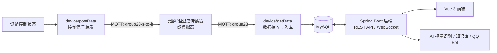

# 智慧鹦鹉养护系统

> 面向家庭宠物鹦鹉场景的综合养护平台。项目将烟感与温湿度监测、设备联动、鹦鹉健康档案和 AI 辅助识别整合到同一套 Web 系统中，帮助使用者及时了解笼舍环境与宠物状态。

## 项目亮点

- **环境安全监测**：采集烟雾/粉尘、温度和湿度数据，展示实时状态、历史曲线和环境报告，并支持告警记录与处理。
- **物联网设备联动**：通过 MQTT 接收传感器数据；控制状态可由数据库同步到 MQTT，联动开关、蜂鸣器、报警灯和空气净化器。
- **鹦鹉养护管理**：提供宠物档案、体重记录、病历、账本、图片和录音等养护数据管理能力。
- **智能辅助**：集成鹦鹉行为/种类识别、环境适配评估、智能问诊、饲养手册和知识库问答等功能。
- **多端告警与交互**：支持 WebSocket 实时推送，并可通过 OneBot/NapCat 对接 QQ，实现告警推送和自然语言查询、控制辅助。

## 技术栈

| 层级 | 技术 |
| --- | --- |
| 前端 | Vue 3、Vite、Axios、ECharts、Three.js |
| 后端 | Java 17、Spring Boot 3、Spring Data JPA、WebSocket、Redis |
| 数据库 | MySQL |
| 设备端 | Java 8、Spring Boot 2、Spring Integration MQTT、Paho MQTT、JDBC |
| AI 能力 | SmartJavaAI、YOLO、CLIP；可选接入 Qwen、MaxKB |

## 系统架构



### 数据流说明

1. 传感器或 `device/simulate` 向 MQTT 主题 `group23` 发布数据。
2. `device/getData` 订阅消息，将烟雾、温度、湿度分别写入 MySQL。
3. 后端读取业务与监测数据，生成告警、环境报告和宠物养护数据，并提供 REST API 与 WebSocket 推送。
4. 前端通过后端 API 展示监控大屏、鹦鹉档案和养护功能。
5. 用户在前端修改设备状态后，`device/postData` 将控制信息发布到 `group23-s-to-h`，由硬件执行。

## 核心功能

### 环境监测与告警

- 烟雾/粉尘、温度、湿度实时数据与历史趋势查询。
- 环境小时报表、风险等级和设备在线状态展示。
- 告警日志、处理记录与 WebSocket 实时推送。
- 设备管理与控制状态维护。

### 鹦鹉养护

- 鹦鹉档案、品种信息、照片与录音管理。
- 体重变化、病历和养护账本记录。
- 健康评分、成长报告、环境适配评估与智能问诊。
- 本地 Markdown 饲养教程与知识库内容展示。

### 智能与扩展能力

- 基于 YOLO/CLIP 的鹦鹉种类与行为识别。
- 可选接入视觉大模型进行图片复核。
- 可选接入 MaxKB 知识库及 OneBot/NapCat QQ 机器人，用于问答、告警推送和设备辅助控制。

## 快速开始

### 1. 环境要求

| 工具 | 建议版本 | 用途 |
| --- | --- | --- |
| JDK | 17+ | 运行 `backend` |
| JDK | 8+ | 运行 `device` 下的设备端模块 |
| Maven | 3.8+ | Java 项目构建与启动 |
| Node.js | 18+ | 前端依赖安装与启动 |
| npm | 随 Node.js 安装 | 运行前端脚本 |
| MySQL | 5.7/8.0+ | 存储业务与监测数据 |
| Redis | 可选 | 后端缓存能力 |
| MQTT Broker | 必需 | 设备数据与控制消息转发 |

### 2. 初始化数据库

先创建目标数据库，再按顺序导入数据库结构和演示数据：

```powershell
# 在项目根目录执行；请将 dream28 替换为自己的数据库名
mysql -u root -p -e "CREATE DATABASE IF NOT EXISTS dream28 DEFAULT CHARACTER SET utf8mb4;"
cmd /c "mysql -u root -p dream28 < group23-struct.sql"
cmd /c "mysql -u root -p dream28 < group23-data.sql"
```

`group23-struct.sql` 包含表结构，`group23-data.sql` 为数据快照。若已有数据库，请根据实际情况决定是否导入数据快照，避免覆盖已有数据。

### 3. 配置运行环境

请根据本机或部署环境修改以下配置；README 不保存账号、密码、Token 或 API Key 等敏感信息。

| 模块 | 配置位置 | 需关注的配置 |
| --- | --- | --- |
| 后端 | `backend/src/main/resources/application.yml` | MySQL、Redis、模型路径、QQ/知识库/大模型扩展配置 |
| 数据接收 | `device/getData/src/main/resources/application.yml` | MQTT、MySQL、设备编号 |
| 控制转发 | `device/postData/src/main/resources/application.yml` | MQTT、MySQL、控制主题 |
| 数据模拟 | `device/simulate/src/main/resources/application.yml` | MQTT、模拟数据区间与发送频率 |
| 前端 | `frontend/.env`、`frontend/vite.config.js` | 后端 API 代理地址 |

建议优先通过配置中已支持的环境变量覆盖数据库、MQTT 和第三方服务参数，例如 `MYSQL_URL`、`MYSQL_USERNAME`、`MYSQL_PASSWORD`、`MQTT_HOST_URL` 与 `MQTT_DATA_TOPIC`。

### 4. 一键启动本地联调链路

根目录启动脚本会依次拉起：`getData`、`simulate`、`backend` 和 `frontend`。其中前三项并行启动，前端会等待后端 `8080` 端口就绪后启动。

```powershell
# PowerShell
.\start-local.ps1
```

若 PowerShell 执行策略限制脚本，可双击或执行：

```powershell
.\start-local.bat
```

启动成功后访问：

- 前端页面：<http://localhost:5173>
- 后端服务：<http://localhost:8080>

按 `Ctrl+C` 可结束脚本启动的全部服务窗口。请分别查看各服务窗口日志，确认 MQTT、MySQL 与后端连接正常。

### 5. 按模块单独启动

需要调试某一模块时，可在对应目录执行：

```powershell
# 后端
cd backend
mvn spring-boot:run

# 前端（首次运行先安装依赖）
cd frontend
npm install
npm run dev

# MQTT 数据接收、控制转发或温湿度模拟
cd device/getData     # 或 device/postData、device/simulate
mvn spring-boot:run
```

## 目录说明

```text
Chinasoft-Project-group23/
├─ backend/                 Spring Boot 后端：业务 API、告警、WebSocket、AI 扩展
├─ frontend/                Vue 3 前端：监控大屏与鹦鹉养护页面
├─ device/
│  ├─ getData/              MQTT 数据订阅与 MySQL 入库
│  ├─ postData/             数据库控制状态到 MQTT 的转发
│  ├─ simulate/             温湿度 MQTT 模拟器
│  └─ MQTT/                 MQTT 收发调试工具
├─ smartjavaai-models/      本地 AI 模型与配套资源说明
├─ 文档/                    API、数据库设计和实训项目文档
├─ 知识库/                  鹦鹉养护知识库 Markdown 内容
├─ 原型设计/                页面与交互原型素材
├─ 交付/                    阶段交付物与 3D 模型相关材料
├─ group23-struct.sql       数据库表结构与索引
├─ group23-data.sql         数据库数据快照
├─ start-local.ps1          本地联调一键启动脚本
└─ start-local.bat          Windows 批处理启动入口
```

## 验证建议

完成启动后，可按以下顺序检查：

1. 前端页面能正常打开，且可请求后端数据。
2. `getData` 日志显示已连接 MQTT 并订阅数据主题。
3. `simulate` 持续发布温湿度数据后，数据库中的 `temperature_data`、`humidity_data` 有新增记录。
4. 后端 `8080` 端口正常监听，监控数据和告警页面能显示数据。
5. 若使用真实硬件，确认 `device/postData` 的控制主题与固件订阅主题一致，再进行设备控制测试。

## 答辩演示建议

可按照下面的业务链路进行演示，便于清晰展示项目从数据采集到用户交互的完整闭环：

1. 启动本地联调链路，展示前端监控大屏中的温度、湿度和烟雾/粉尘实时数据。
2. 打开历史数据或环境报告，说明系统如何保留和分析笼舍环境变化。
3. 展示告警记录与设备状态；有测试硬件时，可演示一次安全的设备联动操作。
4. 进入鹦鹉档案，展示体重、病历、账本、照片或录音等养护记录。
5. 演示行为识别、环境适配、智能问诊或饲养手册等智能养护功能。

## 常见问题

### 前端能打开但没有实时数据

- 检查后端是否已在 `8080` 端口启动，并确认前端开发服务运行在 `5173` 端口。
- 检查 MySQL 连接是否可用，且已导入数据库结构。
- 检查 MQTT Broker 地址、主题和网络连通性；模拟联调时需同时运行 `getData` 与 `simulate`。

### 模拟器启动后数据库没有新记录

- 确认 `device/getData` 已成功订阅 MQTT 的数据主题。
- 确认 `device/getData` 与 `device/simulate` 使用相同的 MQTT Broker 和数据主题。
- 检查数据库连接参数、数据库名和数据表是否与当前环境一致。

### AI 功能不可用

- 检查 `smartjavaai-models/` 中的模型与配套资源是否完整。
- 根据实际本机路径调整后端 `application.yml` 中的模型路径。
- 未配置第三方视觉大模型、MaxKB 或 QQ 服务时，对应扩展功能不可用，但不影响核心监测与养护功能。

## 相关文档

- [项目需求说明](docs/PROJECT_REQUIREMENTS.md)
- [后端说明](backend/README.md)
- [API 接口文档](文档/智慧烟感API接口文档.md)
- [数据库表结构设计](文档/智慧烟感数据库表结构设计.md)
- [MQTT 数据接收服务说明](device/getData/README.md)
- [MQTT 控制转发服务说明](device/postData/README.md)
- [温湿度模拟器说明](device/simulate/README.md)
- [本地 AI 模型资源说明](smartjavaai-models/README.md)
- [3D 鹦鹉模型代码说明](交付/3D鹦鹉模型代码-20260711/README-模型代码说明.md)

## 项目交付说明

本仓库包含源代码、数据库结构与数据备份、原型设计、知识库和阶段交付材料。答辩演示时建议依次展示：实时环境监控、告警与设备联动、鹦鹉档案与健康记录、AI 识别/养护辅助等核心流程。

> 本项目为实训项目。第三方 MQTT、QQ、知识库与大模型服务均依赖具体部署环境；交付或公开仓库前，请使用环境变量或私有配置文件管理敏感信息。
